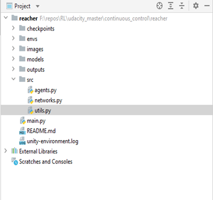
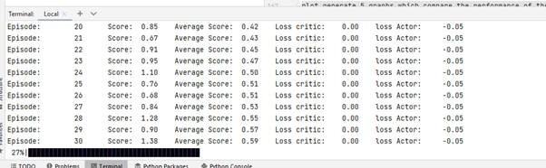
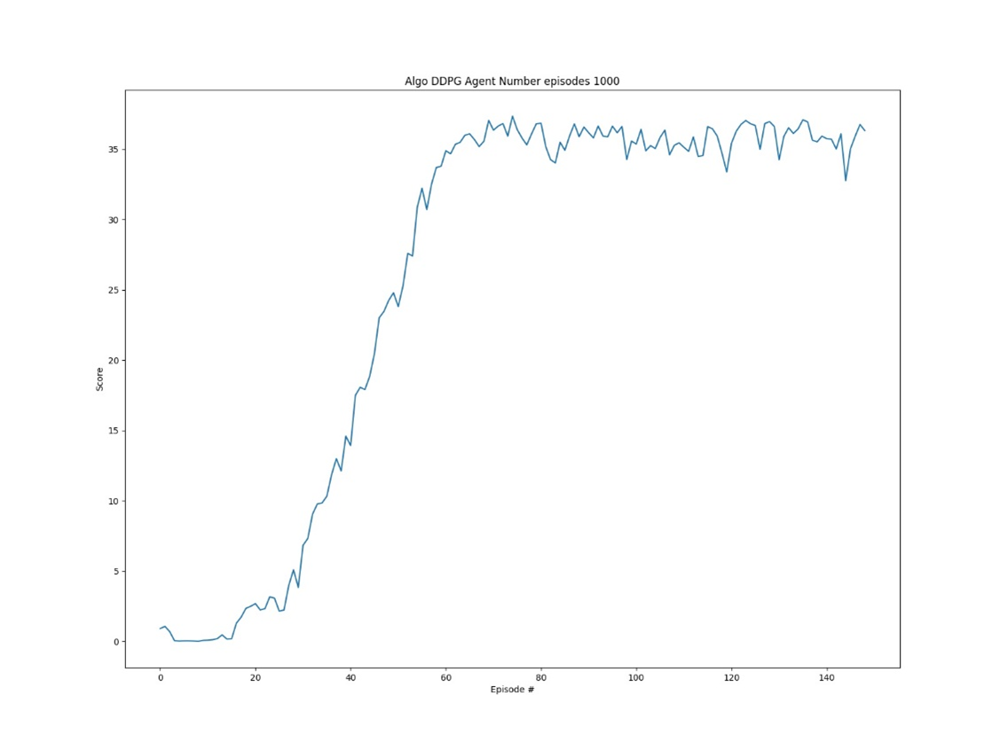
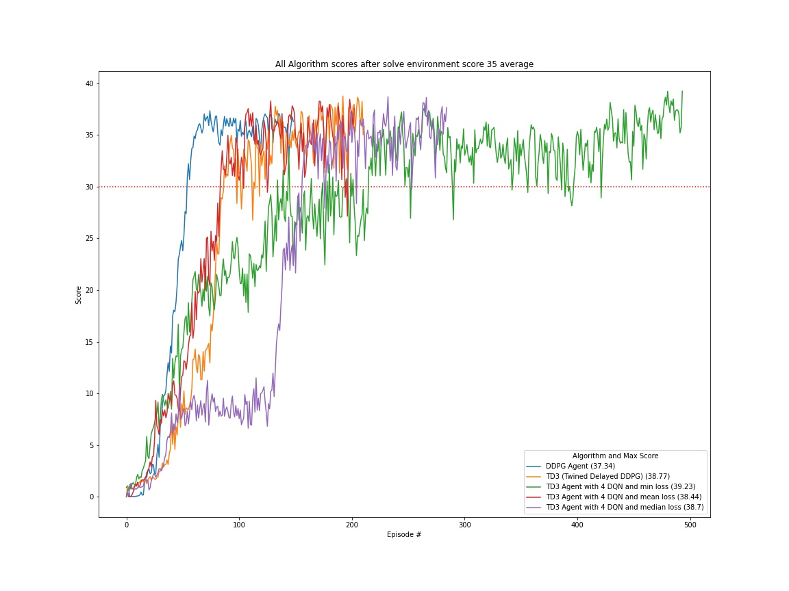
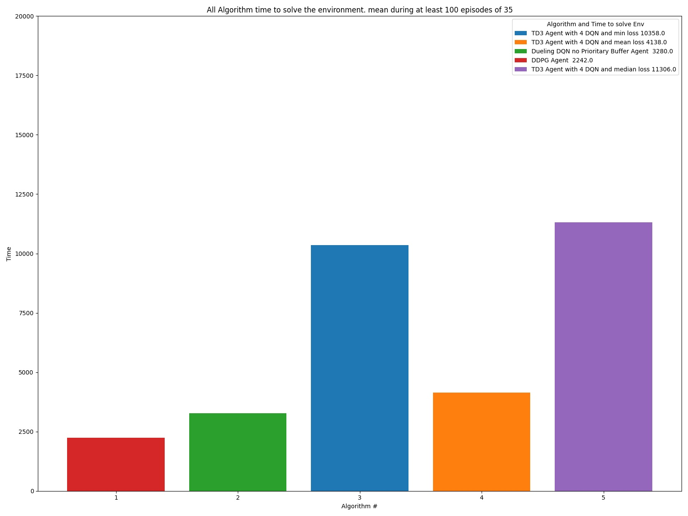
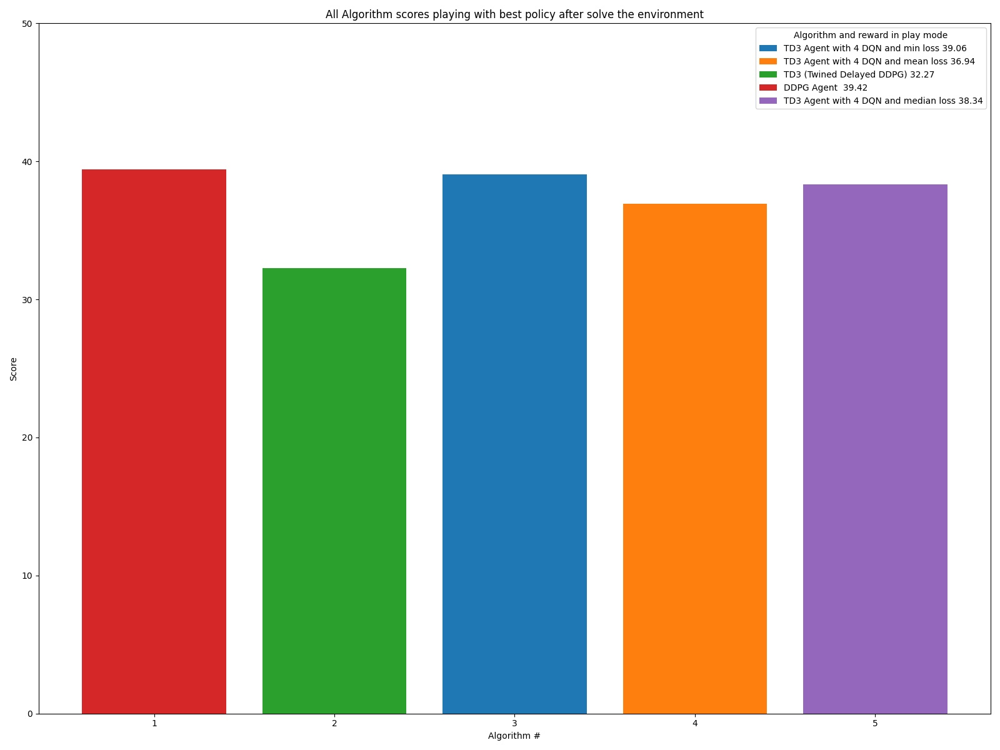
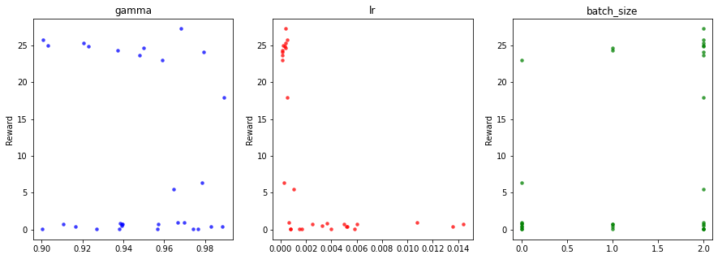

# Udacity_Reacher_Unity

### Introduction
This repo contains my solution to the challenge for the project Continous control part of the Udacity Deep Reinforcement 
Learning Nanodegree. My solution covers 2 different algorithms (DDPG and TD3)). In TD3 I have made some variants, while the author of the original paper propose, the minimum between the two estimates (implemented in type 2) , while here I create 3 new variants using 4 estimates (DQN critics Networks) and use minimum(type 3), mean(type 4) or Median(type 6) to select the estimate. The skeleton of this solution is based on the coding exercise on the actor-critic methods (DDPG) implementation of this program, while I also use other resources like books, or public information available to learn and complete the solution which I will detail on the references. The skeleton of this solution is based on the coding exercise on the actor-critic methods (DDPG) implementation of this program, while I also use other resources like books, or public information available to learn and complete the solution which I will detail on the references.

The solution is fully tested with the 20 agent’s worker, and I made some test with the 1 Agent version using other algorithms like D4PG or A2C, but finally not included on the final release of this project.

The application solves the environment with the following 5 implementations
- Mode 1 Plain DDPG. (Deep Deterministic Policy Gradient)
- Mode 2 TD3 (Twined Delayed DDPG)
- Mode 3 TD3 with 4 DQN critic Networks estimate min selection
- Mode 4 TD3 with 4 DQN critic Networks estimate mean selection
- Mode 6 TD3 with 4 DQN critic Networks estimate median selection

### Installation
My solution works as an stand alone application which run in a Windows Pro 10 64 bits command line window 
(I did not try in Linux, but I suspect that with minimum changes it will work). 

### Setup the environment
1 create a conda environment    
    
    conda create --name drlnd python=3.6 
    activate drlnd
2 install gym library
    
    pip install gym or pip install gym[atari] 

3 clone this repo

    git clone https://github.com/olonok69/Udacity_Reacher_project.git
    cd Udacity_Reacher_project
4 install rest of dependencies (I left a file with the content of all libraries of my setup named pip_library.txt)

    pip install -r requirements.txt
    
5 install a kernel in jupyter(optional)
    
    python -m ipykernel install --user --name drlnd --display-name "drlnd"

6 Install Unity agent (in repo you have the windows 64 version, but if you plan to install it) (2 versions of the agent)

  Version 1: One (1) Agent
- Linux https://s3-us-west-1.amazonaws.com/udacity-drlnd/P2/Reacher/one_agent/Reacher_Linux.zip
- MacOs https://s3-us-west-1.amazonaws.com/udacity-drlnd/P2/Reacher/one_agent/Reacher.app.zip
- Win32 https://s3-us-west-1.amazonaws.com/udacity-drlnd/P2/Reacher/one_agent/Reacher_Windows_x86.zip
- Win64 https://s3-us-west-1.amazonaws.com/udacity-drlnd/P2/Reacher/one_agent/Reacher_Windows_x86_64.zip

  Version 2: Twenty (20) Agents

- Linux https://s3-us-west-1.amazonaws.com/udacity-drlnd/P2/Reacher/Reacher_Linux.zip
- MacOs https://s3-us-west-1.amazonaws.com/udacity-drlnd/P2/Reacher/Reacher_Linux.zip
- Win32 https://s3-us-west-1.amazonaws.com/udacity-drlnd/P2/Reacher/Reacher_Windows_x86.zip
- Win64 https://s3-us-west-1.amazonaws.com/udacity-drlnd/P2/Reacher/Reacher_Windows_x86_64.zip

  Then, place the file in the Udacity_Reacher_project/envs/ folder and unzip (or decompress) the file.

### Environment

  In this environment, a double-jointed arm can move to target locations. A reward of +0.1 is provided for each step that the agent's hand is in the goal location. Thus, the goal of your agent is to maintain its position at the target location for as many time steps as possible.

The observation space consists of 33 variables corresponding to position, rotation, velocity, and angular velocities of the arm. Each action is a vector with four numbers, corresponding to torque applicable to two joints. Every entry in the action vector should be a number between -1 and 1.

  The state space has 37 dimensions and contains the agent's velocity, along with ray-based perception of objects 
  around the agent's forward direction. Given this information, the agent has to learn how to best select actions. 
  Four discrete actions are available, corresponding to:

For this project, we will provide you with two separate versions of the Unity environment:

**Distributed Training**
* The first version contains a single agent.
* The second version contains 20 identical agents, each with its own copy of the environment.

**Solving the Environment**

Option 1: Solve the First Version
The task is episodic, and in order to solve the environment, your agent must get an average score of +30 over 100 consecutive episodes.

Option 2: Solve the Second Version
The barrier for solving the second version of the environment is slightly different, to take into account the presence of many agents. In particular, your agents must get an average score of +30 (over 100 consecutive episodes, and over all agents). Specifically,

After each episode, we add up the rewards that each agent received (without discounting), to get a score for each agent. This yields 20 (potentially different) scores. We then take the average of these 20 scores.
This yields an average score for each episode (where the average is over all 20 agents). (My solution is configured to finish the problem as the agent hit 35+ over 100 consecutive episodes)

### how to run this project

on the main directory run python main.py --mode [training|play|plot|hp_tuning] 
                                                --type[1,2,3,4,6]
                                                -- agent [1,2]

all args are mandatory

--mode  training|play|compare|hp_tuning --> Mandatory

* training : Train and agent. Save a model policy if the agent get more or equals than 35 
* play : play an agent with a save policy and report the score
* plot : generate the plot from information collected in compare modes
* hp_tuning :  hyper parameter tuning example

--type --> Mandatory

* type 1--> Plain DDPG. (Deep Deterministic Policy Gradient) 
* type 2--> TD3 (Twined Delayed DDPG) 
* type 3--> TD3 with 4 DQN critic Networks min estimate selection
* type 4--> TD3 with 4 DQN critic Networks mean estimate selection
* type 6--> TD3 with 4 DQN critic Networks median estimate selection

--agent --> Mandatory
* 1 Reacher with 1 Arm
* 2 Reacher with 20 Arms

Ex. python main.py --mode training --type 1 –agent 2

### Directory Structure
* env: the unity environments
* images: Folder where I save plots during training and final plots
* models: Folder where I save the final models. Those that solve the environment
* checkpoints: Folder where I save the operational models
* outputs: Folder where I save a pickle file containing a dictionary which contains all data to build the final plots and this report
* src: contains python scripts with classes to support the application
* In the root I have the python scripts, and some cmd scripts to help to run in a loop the environment using different algorithms either during training phase or during play phase

###files
* root
  - Main.py: Contains the logic which govern the 5 main operations modes
  
* In src folder
  - Agents.py: contains classes which wrap the operation of the Banana env working with different algorithms and buffers. Additionally, some functions to operate the env in training or play mode
  - Networks: contains different implementation of Neural Network architectures use by the agents to solve the environment
  - Utils.py: contains helpers to monitor, plot and instantiate the agents, together with buffers classes, Noise classes and others to support the application
* in env folder
  - Reacher Unity environments

* the script during training is printing the average reward every episode

* and during training mode we save loss and rewards to finally plot them one the game finish, which is either after 1000
episodes or where the agent reach 35+ as reward in training

Ex. Rewards

### Mode plot
after runing the application in mode compare and the compare_play, where the app collect information to later in mode 
plot generate 5 graphs which compare the performance of the 8 solvers

All algorithms Rewards. Solve the environment 35+ as reward on average 100 Episodes

All algorithms Time to win the Environtment (reward 35+ average 100 episodes)

All algorithms mode play score with best policy

### Mode hp_tuning

In mode hp_tuning and using library Hyperopt library, I set up an example of how to optimize parameters of an agent 
using Bayesian Optimization. It it’s just a simple example but give you a grasp of how we can optimize the 
parameters. There are other frameworks to optimize parameters like RL Baselines3 Zoo if we use Stable baselines library 
or Ray for unity RL agents, but here as this is a tailored environment, I decided to use a general optimization framework 
and also learn how to use it in Deep RL.
Here in this simple configuration, I am optimizing 3 parameters of the DDPG agent model and I limit the trials 
to 30 for this experiment

### References

1. A2C Mnih, Volodymyr, et al. "Asynchronous methods for deep reinforcement learning." International conference on machine learning. 2016.
2. PPO: J. Schulman et al., "Proximal Policy Optimization Algorithms." arXiv preprint arXiv:1707.06347, 2017.
3. TRPO: Schulman, John, et al. "Trust region policy optimization." International conference on machine learning. 2015.
4. DDPG:T. P. Lillicrap et al., "Continuous control with deep reinforcement learning." arXiv preprint arXiv:1509.02971, 2015.
5. OU Noise https://github.com/udacity/deep-reinforcement-learning/blob/master/    ddpg-pendulum/ddpg_agent.py
6. https://en.wikipedia.org/wiki/Ornstein%E2%80%93Uhlenbeck_process
7. TD3 Fujimoto, Scott, Herke van Hoof, and David Meger. "Addressing function approximation error in actor-critic methods." arXiv preprint arXiv:1802.09477 2018.
8. SAC T. Haarnoja et al., "Soft Actor-Critic: Off-Policy Maximum Entropy Deep Reinforcement Learning with a Stochastic Actor." arXiv preprint arXiv:1801.01290, 2018.
9. T. Haarnoja et al., "Soft Actor-Critic Algorithms and Applications." arXiv preprint arXiv:1812.05905, 2018.
10. D4PG https://openreview.net/pdf?id=SyZipzbCb
11. https://github.com/Curt-Park/rainbow-is-all-you-need
12. https://github.com/MrSyee/pg-is-all-you-need
13. Hands-on Reinforcement Learning for Games (Book) Michael Lanham
14. Grokking Deep Reinforcement Learning (Book) Miguel Morales
15. Hands-on Reinforcement Learning with Python (book) by Sudharsan Ravichandiran
16. binary sum-tree. See Appendix B.2.1. in https://arxiv.org/pdf/1511.05952.pdf. Adapted implementation from https://github.com/jaromiru/AI-blog/blob/master/SumTree.py  
17. SegmentTree from OpenAi repository. https://github.com/openai/baselines/blob/master/baselines/common/segment_tree.py
18. PER implementation. https://github.com/rlcode/per/blob/master/prioritized_memory.py
19. https://pytorch.org/docs

